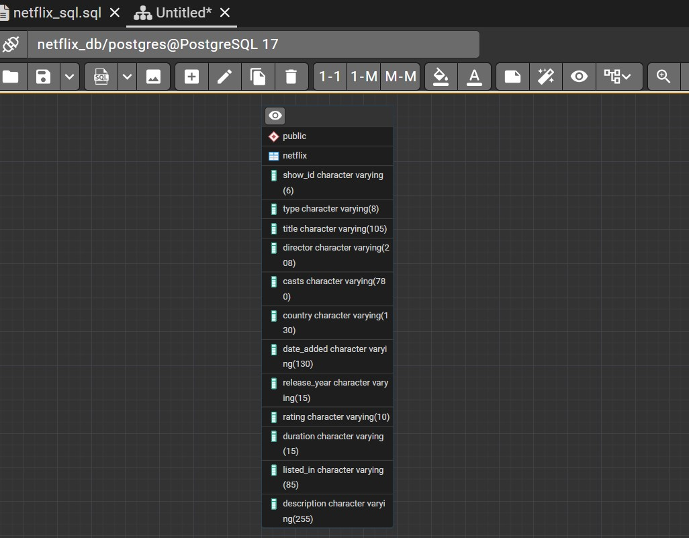

<p align="center">
  
</p>

# Netflix Movies and TV Shows Data Analysis using SQL

## Overview
This project involves a comprehensive analysis of Netflix's movies and TV shows data using SQL. The goal is to extract valuable insights and answer various business questions based on the dataset. This README provides a detailed account of the project's objectives, business problems, solutions, findings, and conclusions.

## Objectives

- Analyze the distribution of content types (movies vs TV shows).
- Identify the most common ratings for movies and TV shows.
- List and analyze content based on release years, countries, and durations.
- Explore and categorize content based on specific criteria and keywords.

## Dataset

The data for this project is sourced from the Kaggle dataset:

- **Dataset Link:** [Movies Dataset](https://www.kaggle.com/datasets/shivamb/netflix-shows?resource=download)

## Schema

```sql
DROP TABLE IF EXISTS netflix;
CREATE TABLE netflix(
	show_id VARCHAR(6),
	type VARCHAR(8),
	title VARCHAR(105),
	director VARCHAR(208),
	casts VARCHAR(780),
	country VARCHAR(130),
	date_added VARCHAR(130),
	release_year INT,
	rating VARCHAR(10),
	duration VARCHAR(15),
	listed_in VARCHAR(85),
	description VARCHAR(255)
);
```



## Business Problems and Solutions

### 1. Count the Number of Movies vs TV Shows

```sql
SELECT 
	type,
	COUNT(*)
FROM netflix
GROUP BY 1;		
```

**Objective:** Determine the distribution of content types on Netflix.

### 2. Find the Most Common Rating for Movies and TV Shows

```sql
SELECT 
	type,
	rating,
	count(*)
FROM netflix
GROUP BY 1,2
ORDER BY 3 DESC;

```

**Objective:** Identify the most frequently occurring rating for each type of content.

### 3. List All Movies Released in a Specific Year (e.g., 2020)

```sql
SELECT *
FROM netflix

SELECT 
	*
FROM 
	netflix
WHERE type='Movie' AND release_year ='2020'
```

**Objective:** Retrieve all movies released in a specific year.

### 4. Find the Top 5 Countries with the Most Content on Netflix

```sql
SELECT 
	DISTINCT country, COUNT(*)
FROM netflix
GROUP BY 1
ORDER BY 2 DESC
LIMIT 5
```

**Objective:** Identify the top 5 countries with the highest number of content items.

### 5. Identify the Longest Movie

```sql
SELECT 
	*
FROM netflix
WHERE type ='Movie'
	AND duration IS NOT NULL
ORDER BY SPLIT_PART(duration,' ',1)::INT DESC
LIMIT 1

```

**Objective:** Find the movie with the longest duration.

### 6. Find Content Added in the Last 5 Years

```sql
SELECT
	*
FROM 
	netflix
WHERE 
	release_year::INT> EXTRACT(YEAR FROM CURRENT_DATE )-5
```

**Objective:** Retrieve content added to Netflix in the last 5 years.

### 7. Find All Movies/TV Shows by Director \'Rajiv Chilaka\'

```sql
SELECT
	*
FROM
	netflix
WHERE 
	director= 'Rajiv Chilaka'
```

**Objective:** List all content directed by \'Rajiv Chilaka\'.

### 8. List All TV Shows with More Than 5 Seasons

```sql
SELECT
	type,
	duration
FROM 
	netflix
WHERE
	type = 'TV Show'
	AND SPLIT_PART(duration,' ',1)::INT >5;
```

**Objective:** Identify TV shows with more than 5 seasons.

### 9. Count the Number of Content Items in Each Genre

```sql
SELECT
	DISTINCT listed_in,
	COUNT(*)
FROM 
	netflix
GROUP BY 1
ORDER BY 2 DESC;
```

**Objective:** Count the number of content items in each genre.

### 10.Find each year and the average numbers of content release in India on netflix. 
return top 5 year with highest avg content release!

```sql
SELECT 
	release_year AS years_of_release,
	COUNT(*) AS toral_movie_release_in_india
FROM
	netflix
WHERE
	country='India'
GROUP BY 1;

```
### return top 5 year with highest avg content release!
```sql
SELECT 
	release_year AS years_of_release,
	COUNT(*) AS toral_movie_release_in_india
FROM
	netflix
WHERE
	country='India'
GROUP BY 1
ORDER BY 2 DESC
LIMIT 5;

```

**Objective:** Calculate and rank years by the average number of content releases by India.


### 11. List All Movies that are Documentaries

```sql
SELECT
	title AS all_the_movies_those_are_documentaries
FROM 
	netflix
WHERE
	type='Movie'
	AND listed_in = 'Documentaries'
```

**Objective:** Retrieve all movies classified as documentaries.

### 12. Find All Content Without a Director

```sql
SELECT *
FROM netflix
WHERE director IS NULL;
```

**Objective:** List content that does not have a director.

### 13. Find How Many Movies Actor \'Salman Khan\' Appeared in the Last 10 Years

```sql
SELECT 
	*	
FROM
	netflix
WHERE 
	casts LIKE '%Salman Khan%'
	AND release_year::INT > EXTRACT(YEAR FROM CURRENT_DATE) - 20
```

**Objective:** Count the number of movies featuring \'Salman Khan\' in the last 10 years.

### 14. Find the Top 10 Actors Who Have Appeared in the Highest Number of Movies Produced in India

```sql
SELECT
	UNNEST(STRING_TO_ARRAY(casts,',')) AS actor,
	COUNT(*)
FROM netflix
GROUP BY 1
ORDER BY 2 DESC
LIMIT 10
```

**Objective:** Identify the top 10 actors with the most appearances in Indian-produced movies.

### 15. Categorize Content Based on the Presence of \'Kill\' and \'Violence\' Keywords

```sql
SELECT 
	category,
	type,
	COUNT(*)
FROM(
	SELECT
		*,
		CASE
			WHEN description LIKE '%kill%' OR description LIKE '%violence' THEN 'Bad'
			ELSE 'Good'
		END AS category
	FROM 
		netflix)
GROUP BY 1,2
ORDER BY 3 DESC

```

**Objective:** Categorize content as \'Bad\' if it contains \'kill\' or \'violence\' and \'Good\' otherwise. Count the number of items in each category.

## Findings and Conclusion

- **Content Distribution:** The dataset contains a diverse range of movies and TV shows with varying ratings and genres.
- **Common Ratings:** Insights into the most common ratings provide an understanding of the content\'s target audience.
- **Geographical Insights:** The top countries and the average content releases by India highlight regional content distribution.
- **Content Categorization:** Categorizing content based on specific keywords helps in understanding the nature of content available on Netflix.

This analysis provides a comprehensive view of Netflix\'s content and can help inform content strategy and decision-making.

## 🧪 How to Use This Project

1. **Clone the Repo**

   ```bash
   git clone https://github.com/dhananjoy01/netflix.sql.git
   ```

2. **Import the SQL File** Load `netflix.sql` into your PostgreSQL or compatible database.

3. **Run the Queries** Use any SQL IDE (pgAdmin, DBeaver, MySQL Workbench, etc.) to execute and explore.

4. **Customize Further** Enhance the project by adding joins, window functions, or visual dashboards.

## 👨‍💻 Author & Contact

**Dhanan Joy Chandro Roy**  
Data Analyst | SQL Specialist | Business Intelligence Developer

This project is part of my portfolio, showcasing the SQL skills essential for data analyst roles. If you have any questions, feedback, or would like to collaborate, feel free to get in touch!

### Stay Updated and Join the Community

For more content on SQL, data analysis, and other data-related topics, make sure to follow me on social media and join our community:

- **LinkedIn**: [Connect with me professionally](https://www.linkedin.com/in/dhananjoy01)
- **Portfolio**: [My Data Science Portfolio](https://www.datascienceportfol.io/dhananjoychandro01)
- **GitHub**: [My GitHub Profile](https://github.com/dhananjoy01)
- **Gmail**: dhananjoychandro01@gmail.com

Thank you for your support, and I look forward to connecting with you!

